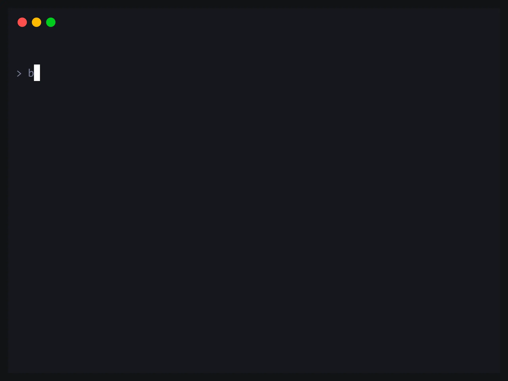

# Koishi-CE

<p align="center">
  <a href="https://github.com/Koishi-CE/koishi/actions/workflows/ci.yml"></a>
  &nbsp;
  <a href="https://codecov.io/gh/Koishi-CE/koishi"></a>
  &nbsp;
  <a href="./NOTICE"></a>
</p>

<p align="center">
  
</p>

Koishi-CE 是 [Koishi](https://koishi.chat) 聊天机器人框架的 **Bun-first 社区再分发版**：[koishijs/koishi](https://github.com/koishijs/koishi)（MIT）与 [koishijs/webui](https://github.com/koishijs/webui)（部分 AGPL-3.0）两个上游仓库在这里被文件级合并重构为单一 monorepo，以 GitHub 组织 [Koishi-CE](https://github.com/Koishi-CE) 发布、npm 作用域 `@koishi-ce`。**本仓库与 Koishijs 组织无隶属关系**；来源与许可证归属见 [NOTICE](./NOTICE)，上游目录映射见 [docs/process/upstream.md](./docs/process/upstream.md)。

## 特性

### 开箱即用

- `bun create koishi-ce` 一条命令生成完整实例：SQLite 数据库、本地控制台、插件市场齐活
- 以 [Bun](https://bun.sh) 为运行时与包管理器，无需预先搭建 Node 工具链
- 适配器与功能插件从市场安装，配置、监控与日志在控制台内完成

### 同步上游

- 框架与控制台两个上游仓库合并为单一 monorepo，统一构建与版本线
- 上游改动按目录映射表手动移植对齐（[docs/process/upstream.md](./docs/process/upstream.md)）
- MIT 与 AGPL-3.0 分区授权，逐目录溯源见 [NOTICE](./NOTICE)

### 工程底线

- 全仓类型检查零错误，全部 node 侧自有包有测试覆盖
- 提交须过 CI 门禁：lint、类型检查、测试、依赖与死代码审计
- 全部产物 ESM-only

## 快速开始

```bash
bun create koishi-ce
```

脚手架生成一个以 Bun 为运行时的 CE 实例：内置纯 `@koishi-ce` 模板、以 npm alias 钉住上游包名（防误装官方包）、不预装 adapter（后续从市场安装），SQLite 数据库插件默认启用。启动后访问 <http://127.0.0.1:5140> 进入控制台。

## 更多

- 文档入口：[docs/README.md](./docs/README.md)；目录结构与包清单见 [docs/reference/architecture.md](./docs/reference/architecture.md)
- 参与贡献：[CONTRIBUTING.md](./.github/CONTRIBUTING.md)（仓库级开发约定见 [AGENTS.md](./AGENTS.md)）
- 行为准则：[CODE_OF_CONDUCT.md](./.github/CODE_OF_CONDUCT.md) · 安全漏洞报告：[SECURITY.md](./.github/SECURITY.md)
- 许可证：MIT 与 AGPL-3.0 分区授权，见 [NOTICE](./NOTICE)

---

## English

Koishi-CE is a **Bun-first community redistribution** of the [Koishi](https://koishi.chat) chatbot framework: [koishijs/koishi](https://github.com/koishijs/koishi) (MIT) and [koishijs/webui](https://github.com/koishijs/webui) (partly AGPL-3.0) merged into a single monorepo, published under the [Koishi-CE](https://github.com/Koishi-CE) organization on the `@koishi-ce` npm scope. **Not affiliated with the Koishijs organization.** Scaffold an instance with `bun create koishi-ce`, then open <http://127.0.0.1:5140> for the console. See [NOTICE](./NOTICE) for licensing and [docs/README.md](./docs/README.md) for documentation.
