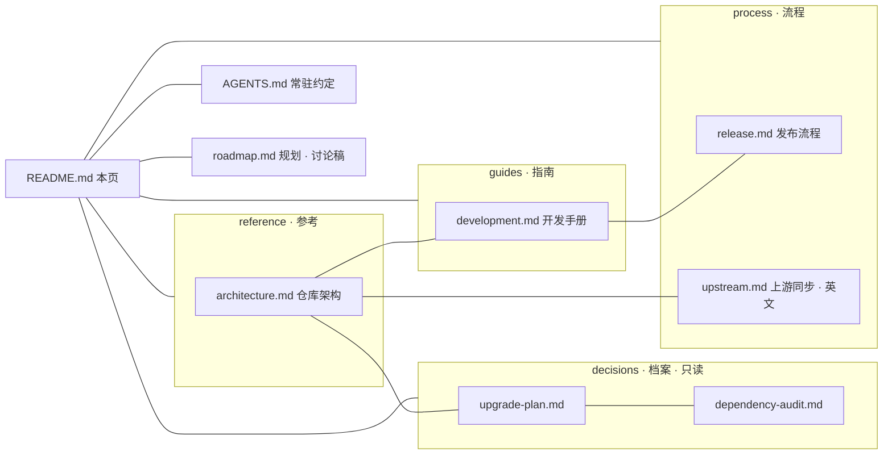

# 文档索引（docs）

> `koishi`（Koishi-CE monorepo）的文档集入口：分层手册、规划与决策档案的导航页。
> 仓库级常驻约定（所有会话与 agent 必读）见 [AGENTS.md](../AGENTS.md)；专职开发 agent 提示词见 [koishi-ce-dev.agent.md](../.github/agents/koishi-ce-dev.agent.md)；人类贡献者入口见 [CONTRIBUTING.md](../.github/CONTRIBUTING.md)。

## 文档地图

docs 根下只有本导航页；文档按性质分层：**指南**（guides，怎么开发）、**参考**（reference，仓库是什么）、**流程**（process，特定流程怎么走）与**档案**（decisions，Why / 历史快照，只读）。

## 手册清单

持续维护（随代码演进更新），以实际代码为准：

| 文档 | 内容速览 | 何时读 |
|---|---|---|
| [guides/development.md](guides/development.md) | 环境 · 命令 · 门禁 · 构建布局 · 编码约定 · 测试 · 已知坑 | 日常开发、跑门禁前 |
| [reference/architecture.md](reference/architecture.md) | 包清单 · 依赖纪律 · 构建 / 类型 / 测试体系 · 许可证分区 | 改包结构 / 依赖 / 构建链前 |
| [process/release.md](process/release.md) | changesets · `bun run release` 发布链 · 事故铁律 | 发版前 |
| [process/upstream.md](process/upstream.md) | 上游基线 · 目录映射表 · port 流程（英文） | 同步上游改动时 |

各手册开头统一带「本文结构」行（编号章节速览），正文引用具体节时用锚点链接。

## 规划

| 文档 | 内容速览 | 状态 |
|---|---|---|
| [roadmap.md](roadmap.md) | 阻塞项 · 进行中 · 计划与候选 · 近期收尾池 | 讨论稿（草案，待维护者确认） |

## 档案区（只读参考）

| 文档 | 内容 | 状态 |
|---|---|---|
| [decisions/upgrade-plan.md](decisions/upgrade-plan.md) | 依赖六阶段升级计划书 | Phase 0-4 已完成；Phase 5（cordis 4.x）被上游阻塞、已回退——重启条件仍是活约束 |
| [decisions/dependency-audit.md](decisions/dependency-audit.md) | 99 个外部依赖立项前全量审计快照 | 历史快照（2026-08-27） |

## 文档组织约定

新增或修改 docs 时遵守，保证结构与风格一致：

1. **分层**：手册（guides / reference / process）持续维护；档案（decisions）只读（开头注明日期与状态）。阶段性设计 / 交接直接写进提交信息，不单独立档。
2. **页面模板**：`# 标题` → 引用块（定位 + 「本文结构」）→ 编号章节。长文档可在开头加节内目录。
3. **章节编号**：中文手册 `## N. 标题` 二级、`### 小节` 三级；引用章节写作「见 §N」或锚点 `目标.md#n-标题`。
4. **交叉引用**：一律相对路径、不带 `./` 前缀（同目录 `release.md`、跨目录 `../guides/development.md`、指仓库根 `../../AGENTS.md`）；docs 根下不新增散落 md，新手册按性质入层。
5. **与 AGENTS.md 不重复**：AGENTS 放铁律（精简），docs 放方法与理由；需要时用链接而非抄写。
6. **不写死漂移数据**：版本号、文件数等以 package.json / 命令输出为准；确需记录时注明日期。
7. **语言**：简体中文、不用 emoji；`process/upstream.md` 为面向公开受众的英文例外。
